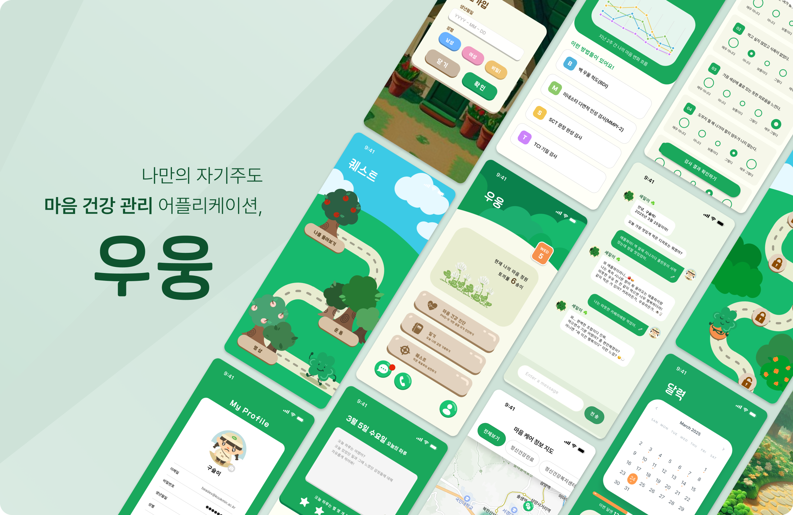
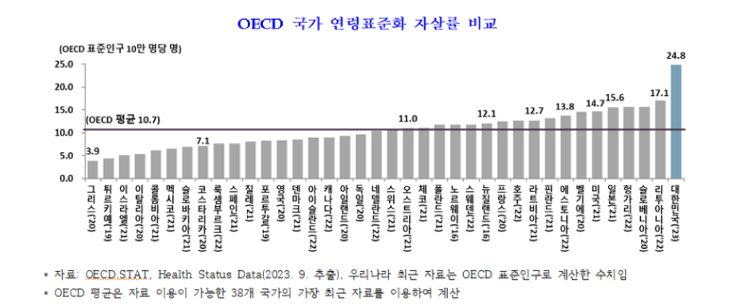
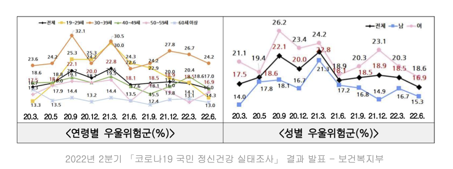
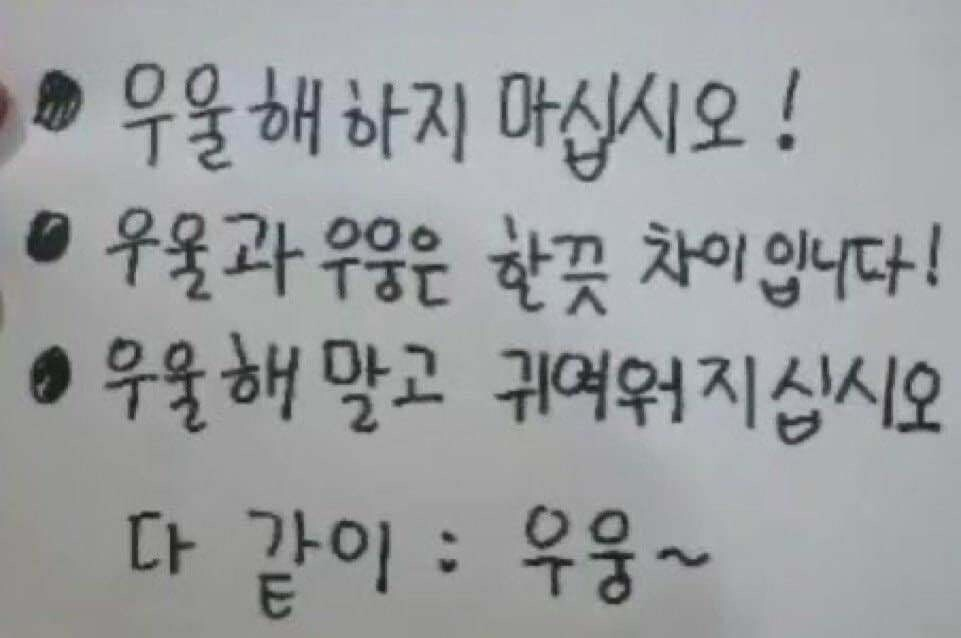
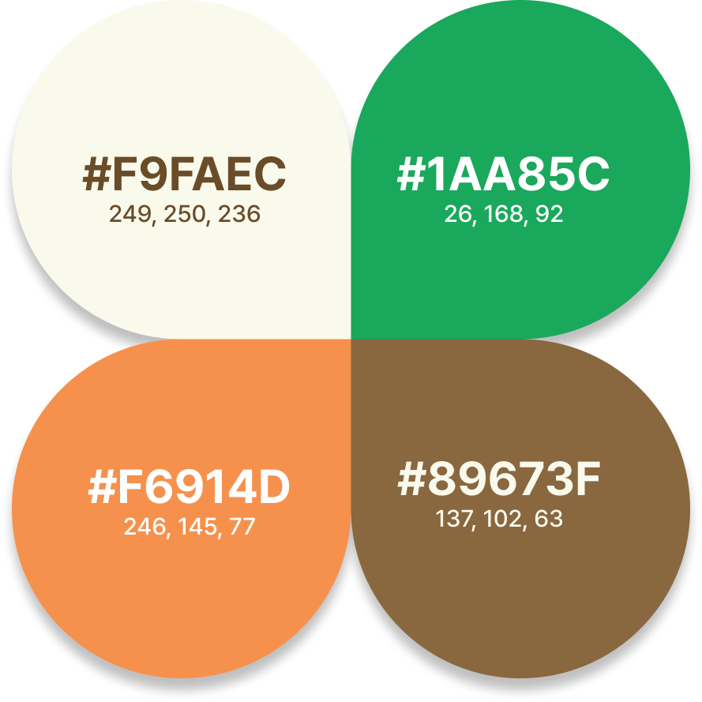

# 📝 프로젝트 소개

## 여러분은 지금 행복하신가요?

### “내가 우울한 건지, 그냥 힘든 건지”

### 코로나19 팬데믹 이후, 우울증을 겪는 사람들의 비율이 크게 증가

### 한국 사회의 구조적 문제와 정신건강 악화

> 코로나19 이후 비대면 중심의 일상이 정착되면서 대화는 줄고 정서적 고립은 더욱 깊어졌습니다.  
> 특히 20·30대의 우울 증세는 급증했고, 한국은 아직도 OECD 국가 중 자살률 1위를 기록하고 있습니다.  
> 하지만 많은 사람들이 사회적 인식과 번거로움, 거부감 등으로 병원 방문에 큰 용기를 필요로 합니다.

이에 정신건강 모바일 앱 시장은 빠르게 성장하고 있지만, 사용자 관점에서 실제 도움을 주기엔 한계가 존재했습니다.

**저희는 다양한 정신건강 앱을 직접 사용해보고 다음과 같은 공통 문제를 발견했습니다:**

- **1\. 진단·치료 기능의 단절** – 흐름이 끊기고, 별도 앱을 요구
- **2\. 낮은 지속 사용 유도력** – 관심을 유지할 장치 부족
- **3\. 과도한 유료화·광고** – 진입 장벽 상승
- **4\. 커뮤니티 부작용** – 부정적 경험의 확산

---

## 🌱 브랜드 아이덴티티

**앱 이름**  
‘우웅~’이라는 인터넷 밈에서 착안하여, 무겁지 않고 **가볍고 따뜻한 느낌**으로 다가갑니다.

**마스코트**  
세잎이와 네잎이라는 클로버 캐릭터. 사용자에게 **소소한 위로와 행운**을 전해주는 존재입니다.

**메인 컬러**  
초록색 – 심리적 안정과 편안함을 상징.  
보조색 – 갈색, 포인트 색 – 주황색으로 따뜻한 활기를 더했습니다.

---

## 👨‍👩‍👧‍👦 팀 해피니스 소개

|                                                                                                                            |                                                                                                                             |                                                                                                                             |                                                                                                                          |                                                                                                                                        |                                                                                                                   |
| -------------------------------------------------------------------------------------------------------------------------- | --------------------------------------------------------------------------------------------------------------------------- | --------------------------------------------------------------------------------------------------------------------------- | ------------------------------------------------------------------------------------------------------------------------ | -------------------------------------------------------------------------------------------------------------------------------------- | ----------------------------------------------------------------------------------------------------------------- |
|   **한초희**  PM&Frontend  [GitHub](https://github.com/cherror) |   **김지윤**  Frontend  [GitHub](https://github.com/Kim-JiYun) |   **김재인**  Frontend  [GitHub](https://github.com/janeny117) |   **최진우**  Backend  [GitHub](https://github.com/20203153) |   **이충호**  Backend  [GitHub](https://github.com/toad-memntomori) |   **이수연**  AI  [GitHub](https://github.com/suyeone) |

---

## ⚙️ 사용법

앱은 현재 \[TestFlight / APK 링크\]를 통해 설치할 수 있습니다.

---

## 🎬 시연 영상

---

## 🖼 기능소개

  
  
  

📱 스토리로 시작되는 마음 여행, 로그인부터 감정 연결의 첫걸음.   
<em>#마음여행시작 #스토리기반 #심리케어첫단계 #게임 #재미 #약식검사 #로그인 #회원가입</em>

  
  
  

🏠 로딩 후 펼쳐지는 내 마음의 홈, 개인정보는 안전하게.   
<em>#홈화면 #관리 #내정보수정</em>

  
  

📅 활동을 되돌아보며 기록하고, 필요할 땐 즉시 도움받기.    
<em>#캘린더 #하루_요약 #활동 #출석 #통계 #기록습관 #상담도움 #심리센터연결 #위치기반</em>

  
  
  

🔐 2차 비밀번호로 안전하게, 정식 진단으로 깊이 있게.    
<em>#개인정보보호 #민감한정보보호 #우울증검사 #정식검사 #진단 #전문성</em>

  
  

📝 감정을 쓰고, 따뜻한 시선으로 다시 바라보기.    
<em>#매일1주제 #채팅 #세잎이 #소통 #챗봇질문 #일기 #럭키비키 #기록 #긍정적사고</em>

  
  
  

🎯 하루 하나씩 나를 위한 퀘스트, 표정 속 진심을 마주하다.    
<em>#퀘스트 #챌린지 #명상 #운동 #숲 #게임</em>

  

📸 카메라 속 나의 표정, 내가 몰랐던 감정을 알려줘요.    
<em>#감정인식 #나돌아보기 #표정분석 #얼굴감지 #셀카</em>

---

## 🛠 기술 스택

### 🖥️ Frontend

  

### ⚙️ Backend

   

### 🧠 AI

        

### 🤝 Co-Work

  

---

## 🖥 개발 환경

- **OS**: Windows 11 / macOS Sequoia 15.2
- **Node.js**: v18.20.8
- **프레임워크**: React Native
- **언어**: TypeScript
- **Expo SDK**: 50.0.3
- **패키지 매니저**: npm
- **운영체제**: Android / iOS 모두 지원
- **백엔드**: Spring Boot (Kotlin)
- **데이터베이스**: MySQL (RDS)
- **API 통신**: RESTful API (Axios 기반)

---

## 시스템 구조도

## 표정분석 플로우

---

## 🤝 협업 방식

> 독립적 개발 + 전체 구조의 일관성 유지 = **효율적 협업 달성!**

- **브랜치 전략**

  > master  
  > ├── 프론트엔드: front-develop  
  > └── 백엔드: develop

  → 명확한 분리로 충돌 없는 병렬 개발

- **커밋 컨벤션**

  | Prefix       | 설명                             |
  | ------------ | -------------------------------- |
  | \[Init\]     | 개발 환경 초기 설정              |
  | \[Feat\]     | 새로운 기능 추가                 |
  | \[Fix\]      | 버그 수정                        |
  | \[Update\]   | 기존 기능 보완                   |
  | \[Remove\]   | 파일 삭제                        |
  | \[Move\]     | 코드 또는 파일 이동              |
  | \[Rename\]   | 파일 또는 폴더 이름 변경         |
  | \[Docs\]     | 문서 수정                        |
  | \[Comment\]  | 주석 추가 또는 변경              |
  | \[Refactor\] | 코드 리팩토링                    |
  | \[Upload\]   | 필요한 이미지나 파일 단순 업로드 |
  | \[Test\]     | 테스트 코드 작성                 |
  | \[Chore\]    | 기타 자잘한 수정                 |

- **이슈 관리**  
  GitHub의 **Issue / Milestone / Label** 적극 활용  
  **Issue 템플릿 5종** 사용 → 작업 명확화 및 문서화
- **PR 규칙**  
  **PR 템플릿** 적용  
  **리뷰 필수**: 팀원 1인의 리뷰 or GitHub Copilot 확인 후 머지 가능  
  → 코드 품질 및 일관성 확보
